TÍTULO:
  Examen Interciclo

ACTIVIDADES DESARROLLADAS
  - Base de Datos Planteada
   
   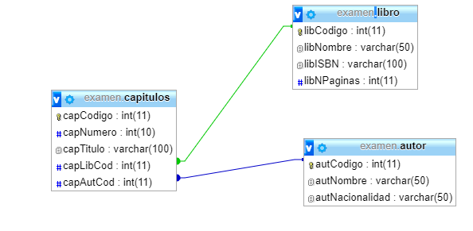</img>
  
  - Pagina Principal:
    Consta de un header y de una seccion, en donde el header contiene 3 botones al lado derecho; el primero
    sirve para crear un Autor, el segundo nos sirve para agregar libros, y el tercero nos lista los libros existentes.
    En la parte de la sección contiene un buscador en donde nos muestra un autor, buscado por su ID.
    
    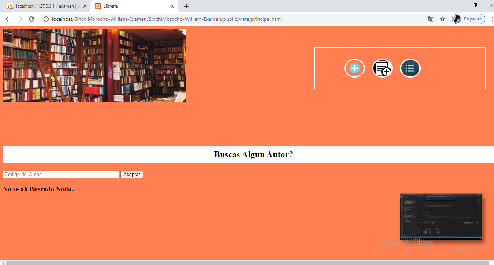</img>
      
      • El Buscador nos muestra una tabla con el id del Autor.
      
    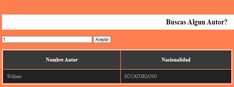</img>
    
  - Pagina para agregar el Autor
  
    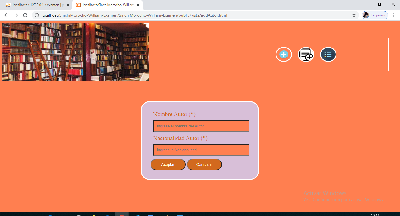</img>
    
      • Autores Agregados a la Base de Datos
     
    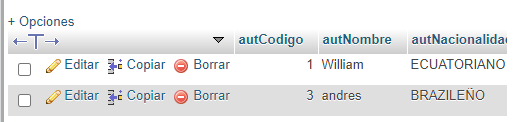</img>
    
   - Pagina para agregar el Libro:
     La página contiene un formulario en el cual ingresaremos los datos del libro para agregarlo.
   
   </img>
    
   • Libros Agregados a la Base de Datos    
      
   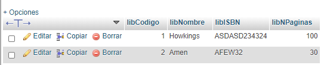</img>
     
  - Pagina en donde nos lista los libros agregados
  
    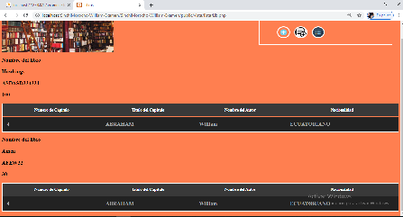</img>
 
  - Codigo para la solucion del Examen
            • Busqueda del Autor (Se utilizo AJAX)
            Codigo en JavaScrip
    
    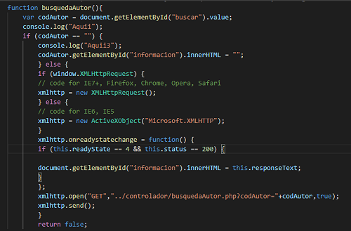</img>
            
            Codigo en php
            
    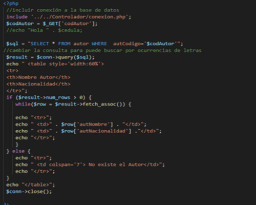</img>
     
            • Agregar Autor
            
     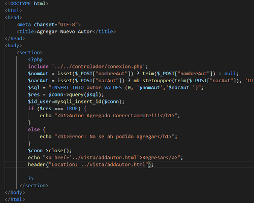</img>
     
            • Busqueda del Autor
     
     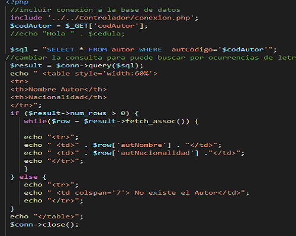</img>
     
            • Listar Autor
     
     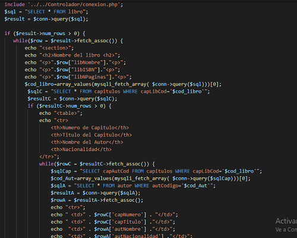</img>
   
   
    
    
    
    
    
    
